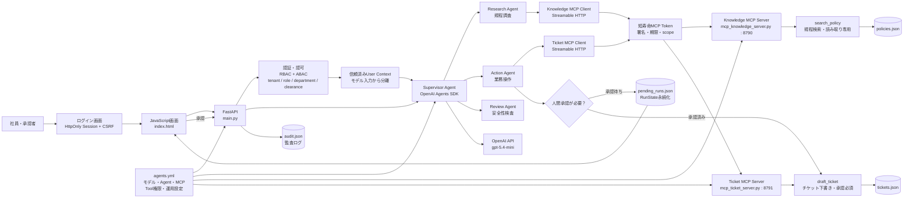

# 本番想定 OpenAI AIエージェント

画面はJavaScript、AIエージェントとMCPはPython、運用設定はYAMLで管理する構成です。OpenAI Agents SDKのSupervisorが専門Agentへ委任し、検索系と更新系で分離したFastMCPサーバーを利用します。

## 構成

```text
Browser (HTML/CSS/JavaScript)
  -> FastAPI / main.py : 認可、rate limit、承認API、監査
    -> OpenAI Agents SDK : Supervisor / Research / Action / Review
      -> Knowledge MCP : search_policy
      -> Ticket MCP : draft_ticket
```

### システム構造図



処理は「ログイン → FastAPIで認証・認可 → Supervisor Agent → 専門Agent → MCPで再認可 → 業務データ」の順に進みます。更新操作は人間承認で一度停止し、承認後に保存済みの`RunState`から再開します。

- `config/agents.yml`: モデル、Agentプロンプト、MCP接続、Tool権限、承認、運用制限
- `main.py`: FastAPIエントリーポイント
- `app/agent_service.py`: OpenAI Agents SDKによるSupervisorと専門Agent
- `app/auth.py`: ログインセッション、MCPトークン、scope検証
- `config/users.yml`: ローカル確認用ユーザーとRBAC / ABAC属性
- `mcp_knowledge_server.py`: 規程検索だけを公開する読み取り専用MCPサーバー
- `mcp_ticket_server.py`: 承認付きチケット操作だけを公開する更新系MCPサーバー
- `index.html`: JavaScript画面
- `data/audit.json`: 監査証跡
- `data/tickets.json`: 承認後に作成した下書き

## ローカル起動

Python 3.12以上を使用します。

```bash
python3 -m venv .venv
source .venv/bin/activate
pip install -e '.[dev]'
```

ターミナル1でKnowledge MCPサーバーを起動します。

```bash
source .venv/bin/activate
python mcp_knowledge_server.py
```

ターミナル2でTicket MCPサーバーを起動します。

```bash
source .venv/bin/activate
python mcp_ticket_server.py
```

ターミナル3でAPIと画面を起動します。

```bash
source .venv/bin/activate
python main.py
```

ブラウザで `http://127.0.0.1:8787` を開きます。Knowledge MCPは`http://127.0.0.1:8790/mcp`、Ticket MCPは`http://127.0.0.1:8791/mcp`です。

## OpenAI APIキー

`.env.local`の`OPENAI_API_KEY`を有効なキーへ変更すると実モデル呼び出しが有効になります。現在のテスト用ダミー値では、Agent実行APIは安全のため`503`を返します。秘密情報はYAMLやGit管理ファイルへ書かないでください。

## ログインと認可

ローカル確認用アカウントは`config/users.yml`にPBKDF2ハッシュで保存しています。本番ではこのローカル認証を企業のOIDC / SSOへ置き換えます。

| アカウント | パスワード | 権限 |
|---|---|---|
| `employee@example.com` | `DemoPass123!` | 一般規程検索、本人名義の下書き要求 |
| `manager@example.com` | `ManagerPass123!` | 営業部の操作承認 |
| `finance@example.com` | `FinancePass123!` | 経理機密規程、監査ログ、操作承認 |

認可は次の層で重ねています。

1. FastAPIがHttpOnly・SameSite Cookieの署名付きセッションを検証
2. 更新APIがCSRFトークンを検証
3. APIがrole・scope・tenantでRBAC / ABACを実施
4. Agentのローカルcontextへログイン属性を格納
5. Agent SDKの`tool_meta_resolver`が短寿命の署名付きMCPトークンを付与
6. MCPサーバーが署名、期限、tenant、department、clearance、scopeを再検証

ユーザーが入力したロールや部署は認可判断に使いません。`SESSION_SECRET`と`MCP_AUTH_SECRET`には異なるランダム値を設定し、本番では`COOKIE_SECURE=true`にしてください。

## Docker起動

```bash
docker compose up --build
```

API、Knowledge MCP、Ticket MCPを別コンテナで起動します。本番ではJSON永続化をPostgreSQL、`.env.local`をSecret Manager、単一プロセス内のrate limitをRedisへ置き換えてください。

## テスト

```bash
source .venv/bin/activate
pytest
```

## セキュリティ境界

- `search_policy`: 読み取り専用、承認不要
- `draft_ticket`: 更新操作、OpenAI Agents SDKのMCP承認中断が必須
- blocklistのToolはAgentへ公開しない
- PIIはAgent入力とTool保存前にマスキング
- ユーザー、判断、承認、Tool実行結果を監査ログへ記録
