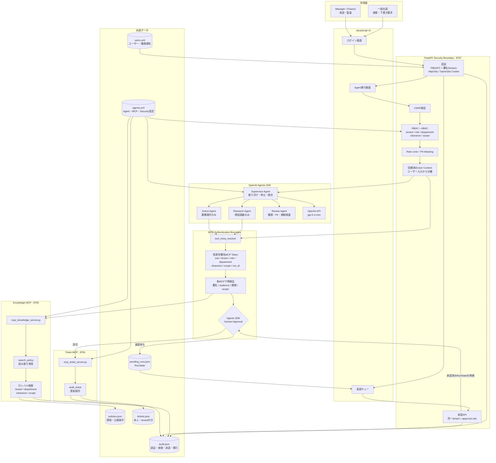

# 本番想定 OpenAI AIエージェント

画面はJavaScript、AIエージェントとMCPはPython、運用設定はYAMLで管理する構成です。OpenAI Agents SDKのSupervisorが専門Agentへ委任し、検索系と更新系で分離したFastMCPサーバーを利用します。

## 構成

```text
Browser (HTML/CSS/JavaScript)
  -> FastAPI / main.py : 認可、rate limit、承認API、監査
    -> OpenAI Agents SDK : Supervisor / Research / Action / Review
      -> Knowledge MCP : search_policy
      -> Ticket MCP : draft_ticket
```

### システム構造図



処理は「ログイン → FastAPIで認証・認可 → Supervisor Agent → 専門Agent → MCPで再認可 → 業務データ」の順に進みます。更新操作は人間承認で一度停止し、承認後に保存済みの`RunState`から再開します。

- `config/agents.yml`: モデル、Agentプロンプト、MCP接続、Tool権限、承認、運用制限
- `main.py`: FastAPIエントリーポイント
- `app/agent_service.py`: OpenAI Agents SDKによるSupervisorと専門Agent
- `app/auth.py`: ログインセッション、MCPトークン、scope検証
- `config/users.yml`: ローカル確認用ユーザーとRBAC / ABAC属性
- `mcp_knowledge_server.py`: 規程検索だけを公開する読み取り専用MCPサーバー
- `mcp_ticket_server.py`: 承認付きチケット操作だけを公開する更新系MCPサーバー
- `index.html`: JavaScript画面
- `data/audit.json`: 監査証跡
- `data/tickets.json`: 承認後に作成した下書き

## 初学者向けの読み方

最初から全ファイルを読む必要はありません。次の順番で読むと、画面からデータ保存までの流れを追えます。

1. `index.html`で、利用者が何を入力するか確認する
2. `main.py`で、HTTP Endpointと認証・認可の順番を確認する
3. `app/agent_service.py`で、Supervisorが専門AgentとMCPをどう使うか確認する
4. `mcp_knowledge_server.py`と`mcp_ticket_server.py`で、読み取りと更新の分離を確認する
5. `app/auth.py`と`app/mcp_identity.py`で、ログイン情報がMCPまで安全に届く流れを確認する
6. `config/agents.yml`で、Agent・Tool・承認設定がコード外にある理由を確認する

### ファイル同士のつながり

| ファイル | 利用用途 | 必要な理由 | 主な接続先と理由 |
|---|---|---|---|
| `index.html` | ログイン・Agent実行・承認UI | 利用者の操作を1画面にまとめる | `main.py`のAPIを呼び、結果を表示する |
| `main.py` | FastAPIの入口 | UI入力を直接AIへ渡さず認証・認可する | `app/auth.py`で本人確認し、`app/agent_service.py`へ処理を渡す |
| `app/config.py` | YAML・環境変数の読込 | 設定誤りを型検証し、環境差をコードから分離する | `config/agents.yml`を全サービス共通のSettingsへ変換する |
| `app/auth.py` | ログイン・Session・MCP Token | ユーザー自己申告ではなく署名済み属性を使う | `config/users.yml`を読み、`main.py`と`app/mcp_identity.py`へ認証結果を渡す |
| `app/security.py` | PIIマスク・rate limit | 個人情報と過剰実行から守る | API、Agent、両MCPが同じ処理を再利用する |
| `app/agent_service.py` | Supervisor・専門Agent・承認再開 | HTTP処理とAI実行制御を分離する | OpenAI API、Knowledge MCP、Ticket MCP、`pending_runs.json`をつなぐ |
| `app/mcp_identity.py` | MCP Token再検証 | データ直前でも権限を確認する | Agentが付けた`_meta`を両MCPでclaimsへ変換する |
| `app/storage.py` | JSON保存・監査 | 保存方法をAgentやMCPから分離する | `data/*.json`への共通read/writeを提供する |
| `mcp_knowledge_server.py` | 規程検索 | 読み取りAgentへ更新権限を渡さない | Research Agentから呼ばれ、`policies.json`を行レベル制限する |
| `mcp_ticket_server.py` | チケット下書き | 副作用のある操作を承認境界へ隔離する | Action Agentから承認後に呼ばれ、`tickets.json`へ保存する |
| `config/agents.yml` | Agent・MCP・Security設定 | 運用変更をPython修正なしで行う | `app/config.py`を通してAPI・Agent・MCPへ共有する |
| `config/users.yml` | ローカルユーザー・権限 | RBAC/ABACの学習・動作確認を可能にする | `app/auth.py`がログイン時に参照する。本番ではSSOへ置換する |
| `Dockerfile` | 共通コンテナ作成 | 実行環境と依存を統一する | `pyproject.toml`を導入し、Composeの各サービスで再利用する |
| `docker-compose.yml` | 3サービス一括起動 | API・読み取りMCP・更新MCPを分離して再現する | `main.py`と2つのMCPサーバーを別ポートで起動する |
| `pyproject.toml` | Python依存・テスト設定 | 必要ライブラリを再現可能にする | Dockerfile、仮想環境、pytestが参照する |
| `.env.example` | 環境変数の記入例 | 秘密値を共有せず必要項目を伝える | `app/config.py`が読む変数名と対応する |
| `.gitignore` | Git除外設定 | 秘密値と自動生成物のcommitを防ぐ | `.env.local`や`.venv`をGit対象外にする |
| `tests/test_auth.py` | 認証テスト | 権限漏えいにつながる回帰を検出する | `app/auth.py`とユーザー設定を確認する |
| `tests/test_config.py` | 設定境界テスト | Tool・MCP分離の設定ミスを検出する | `app/config.py`と`config/agents.yml`を確認する |
| `tests/test_security.py` | PII・rate limitテスト | 共通防御処理の回帰を検出する | `app/security.py`を単体で確認する |

`data/*.json`はコードではなく、デモ用のデータ保存先です。本番では`app/storage.py`の接続先をPostgreSQLなどへ変更します。

## ローカル起動

Python 3.12以上を使用します。

```bash
python3 -m venv .venv
source .venv/bin/activate
pip install -e '.[dev]'
```

ターミナル1でKnowledge MCPサーバーを起動します。

```bash
source .venv/bin/activate
python mcp_knowledge_server.py
```

ターミナル2でTicket MCPサーバーを起動します。

```bash
source .venv/bin/activate
python mcp_ticket_server.py
```

ターミナル3でAPIと画面を起動します。

```bash
source .venv/bin/activate
python main.py
```

ブラウザで `http://127.0.0.1:8787` を開きます。Knowledge MCPは`http://127.0.0.1:8790/mcp`、Ticket MCPは`http://127.0.0.1:8791/mcp`です。

## OpenAI APIキー

`.env.local`の`OPENAI_API_KEY`を有効なキーへ変更すると実モデル呼び出しが有効になります。現在のテスト用ダミー値では、Agent実行APIは安全のため`503`を返します。秘密情報はYAMLやGit管理ファイルへ書かないでください。

## ログインと認可

ローカル確認用アカウントは`config/users.yml`にPBKDF2ハッシュで保存しています。本番ではこのローカル認証を企業のOIDC / SSOへ置き換えます。

| アカウント | パスワード | 権限 |
|---|---|---|
| `employee@example.com` | `DemoPass123!` | 一般規程検索、本人名義の下書き要求 |
| `manager@example.com` | `ManagerPass123!` | 営業部の操作承認 |
| `finance@example.com` | `FinancePass123!` | 経理機密規程、監査ログ、操作承認 |

認可は次の層で重ねています。

1. FastAPIがHttpOnly・SameSite Cookieの署名付きセッションを検証
2. 更新APIがCSRFトークンを検証
3. APIがrole・scope・tenantでRBAC / ABACを実施
4. Agentのローカルcontextへログイン属性を格納
5. Agent SDKの`tool_meta_resolver`が短寿命の署名付きMCPトークンを付与
6. MCPサーバーが署名、期限、tenant、department、clearance、scopeを再検証

ユーザーが入力したロールや部署は認可判断に使いません。`SESSION_SECRET`と`MCP_AUTH_SECRET`には異なるランダム値を設定し、本番では`COOKIE_SECURE=true`にしてください。

## API Endpoint

起動後は`http://127.0.0.1:8787/docs`で、入力スキーマ、認証条件、正常応答、エラー応答を含むOpenAPI仕様を確認できます。

| Method | Endpoint | 認証・権限 | 機能 |
|---|---|---|---|
| `POST` | `/api/auth/login` | 不要、試行回数制限あり | PBKDF2でログインを検証し、HttpOnlyセッションとCSRF値を発行 |
| `GET` | `/api/auth/me` | Session | 現在のrole、tenant、department、clearance、scopeを取得 |
| `POST` | `/api/auth/logout` | Session + CSRF | Cookieを削除し、ログアウトを監査 |
| `GET` | `/api/health` | 不要 | OpenAI設定状態、MCP接続先、Agent数を確認 |
| `GET` | `/api/config` | 不要 | 秘密値を除いたモデル・MCP・Tool境界を取得 |
| `GET` | `/api/audit` | Session + `audit:read` | 同一tenantの監査ログを最大100件取得 |
| `GET` | `/api/approvals` | Session + approval role | 同一tenantの承認待ち一覧を取得 |
| `POST` | `/api/runs` | Session + CSRF + permitted role | PIIをマスクしてSupervisor Agentを実行 |
| `POST` | `/api/runs/{run_id}/approve` | Session + CSRF + `ticket:approve` | tenantを検証し、保存済みRunStateを承認して再開 |
| `GET` | `/` | 不要 | ログイン・Agent実行・承認キューを含むJavaScript UIを配信 |

### MCP Tool

| Server | Tool | 認証・制限 | 機能 |
|---|---|---|---|
| Knowledge MCP `:8790` | `search_policy` | 署名、期限、`policy:read`、tenant、department、clearance | 閲覧可能な社内規程だけを検索し、検索件数を監査 |
| Ticket MCP `:8791` | `draft_ticket` | Agents SDK承認、署名、期限、`ticket:draft` | 本人・tenant・部署を強制付与して下書きを作成 |

## Docker起動

```bash
docker compose up --build
```

API、Knowledge MCP、Ticket MCPを別コンテナで起動します。本番ではJSON永続化をPostgreSQL、`.env.local`をSecret Manager、単一プロセス内のrate limitをRedisへ置き換えてください。

## テスト

```bash
source .venv/bin/activate
pytest
```

## セキュリティ境界

- `search_policy`: 読み取り専用、承認不要
- `draft_ticket`: 更新操作、OpenAI Agents SDKのMCP承認中断が必須
- blocklistのToolはAgentへ公開しない
- PIIはAgent入力とTool保存前にマスキング
- ユーザー、判断、承認、Tool実行結果を監査ログへ記録
